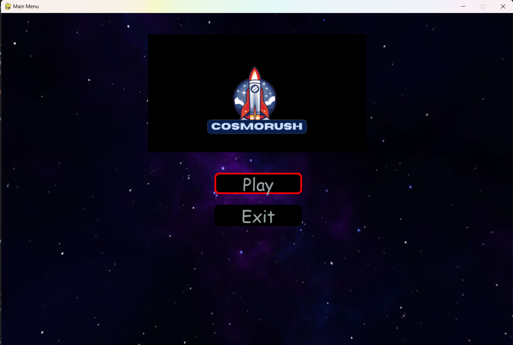
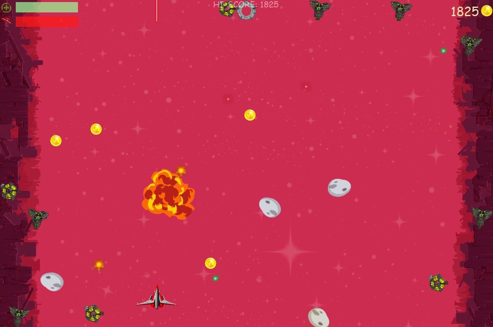
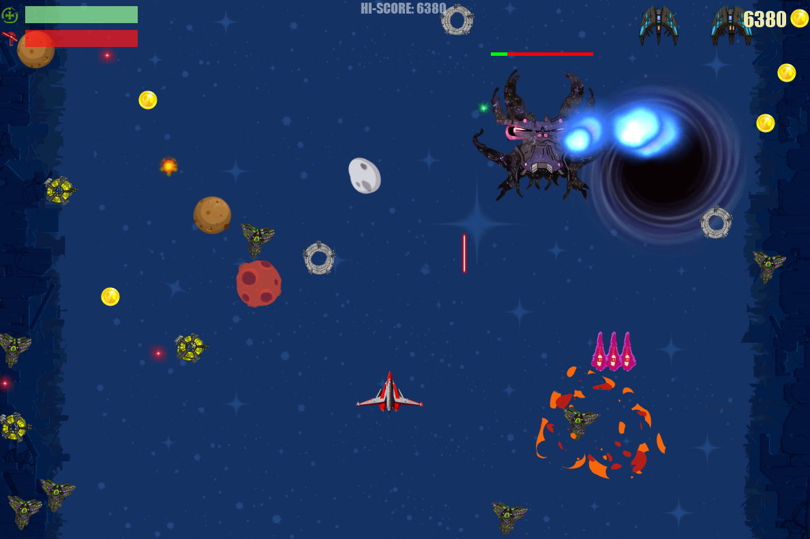
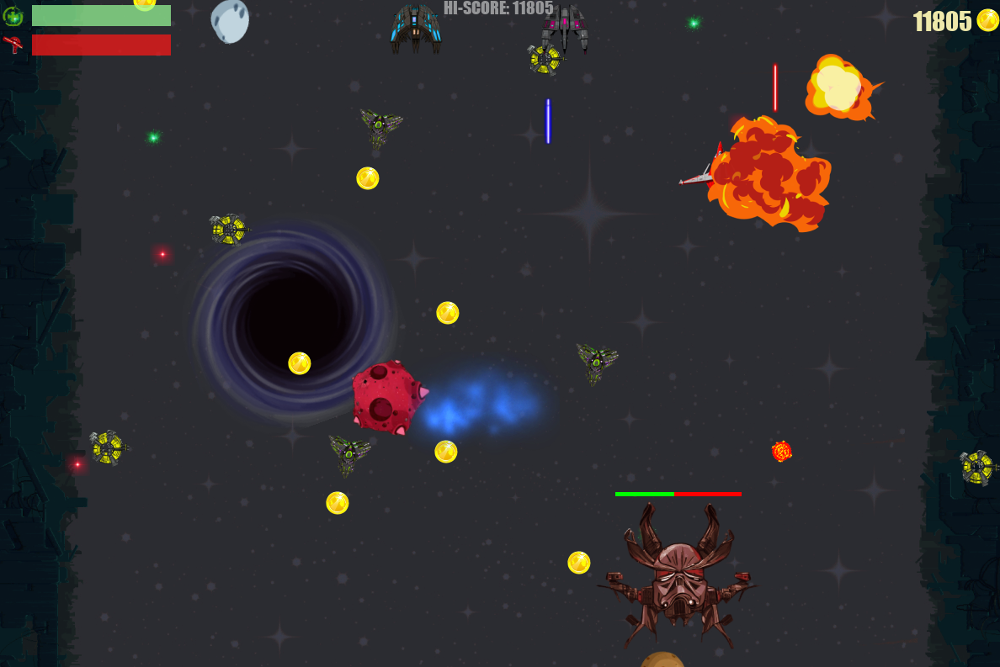
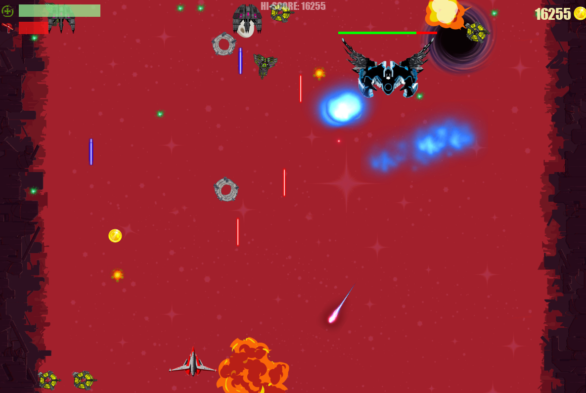

# Cosmo rush
Just a 2D space shooter from a neighboring parallel world. It was written using Python and Pygame. The game is still being updated. To control the player, you can use either the keyboard or a joystick. The game features a variety of cool bosses and enemies that will challenge your skills and keep you engaged. Get ready to blast your way through waves of enemy ships and take on epic boss battles in this exciting space adventure!

# Game Theory and Decision Modeling Concepts:
  - Game Mechanics: The game uses a simple game mechanics system, where the player's score is calculated based on the number of enemies destroyed and the time taken to complete each level. This encourages the player to complete levels quickly and efficiently.
  - Decision Modeling: The game uses decision modeling to simulate the behavior of enemies and bosses. The AI of the enemies is modeled using a simple state machine, where the enemy's behavior changes based on its current state (e.g., moving, shooting, or hiding). This allows for a more realistic and challenging gameplay experience.
  - Game Theory: The game incorporates elements of game theory, such as the prisoner's dilemma, in the design of the boss battles. The player must make strategic decisions about when to attack and when to retreat, taking into account the boss's behavior and the player's own resources.

## Game launch:
 - git clone https://github.com/Nachiket1904/Cosmo-rush.git
 - cd Cosmo-rush
 - python -m venv env
 - source env/Scripts/activate
 - pip install -r requirements.txt
 - python main.py

 ## Controls:
 - shoot - SPACE
 - move - arrows
 - pause - P
 - exit - Esc

## Images

